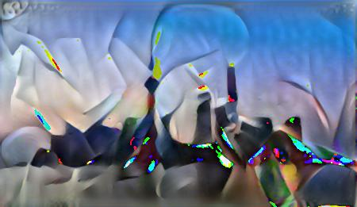
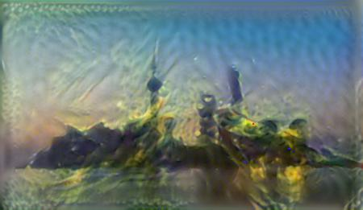

# SimpleStyleMerge
### 图片风格融合
#### 项目介绍
* 用简单的神经网络实时融合两张图片, 一张图片的风格+另一张图片的内容  
* 多年前的卷积网络入门练手, `并非`端到端的网络  
* vgg模型`imagenet-vgg-verydeep-19.mat`放至data/vgg下: 链接:https://pan.baidu.com/s/1IwO-589UZhUolqDICN6SrQ  密码:6qhl

#### example
* 原始图片:  

* 风格特片1:  

* 合成1:  

* 风格特片2:  

* 合成2:  

